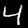

# Handwritten Digit Classification 





## Problem Description
Writing by hand persists, even in the digital age. As more and more processing tasks are ported from humans to machines, the 
ability for a computer system to easily and correctly identify human writing becomes paramount. There are tasks of immediate 
importance, such as when postal services around the globe need to quickly and correctly route the millions of postal items received in a day, 
or when banks must process millions of checks and route the exactly correct amount of money. Failures in these two fields alone are 
inconvenient on a good day and potentially harmful on a bad one.

## Context
This is the capstone project for DataTalks.Club's [Machine Learning Zoomcamp](https://github.com/DataTalksClub/machine-learning-zoomcamp).
This capstone represents my first independent project with a neural network, which is building upon the lessons learned over 
the past four months. 

## The Dataset
*Note: This dataset is downloaded in a special data format and has handling procedures that were not covered in the Zoomcamp.*

The dataset is the [MNIST database](https://en.wikipedia.org/wiki/MNIST_database) of handwritten digits, which is a well-known dataset that is commonly used in beginner
machine learning projects and is sometimes considered the "hello world" example project. The dataset consists of 60,000 
images in the training dataset and 10,000 images in the validation dataset. 

Actual images from the dataset are shown at the top of this README and they look like this:  

They are all 28x28 and greyscale (contain one color channel).

The data can be downloaded via PyTorch using the following:

```python
import torchvision
import torchvision.transforms as transforms
from torchvision.datasets import MNIST

# Define a transformation to convert images to PyTorch tensors
transform = transforms.Compose([
    transforms.ToTensor(),
    transforms.Normalize((0.1307,), (0.3081,)) # Standard normalization for MNIST
])

# Download and load the training data
trainset = MNIST(
    root='./data',      # Directory where data will be saved
    train=True,         # Request the training subset
    download=True,      # Download the data if it's not already present
    transform=transform
)

# Download and load the test data
testset = MNIST(
    root='./data',      # Directory where data will be saved
    train=False,        # Request the test subset
    download=True,      # Download the data if it's not already present
    transform=transform
)
```
The following will be downloaded:
* Downloading http://yann.lecun.com/exdb/mnist/train-images-idx3-ubyte.gz
* Downloading http://yann.lecun.com/exdb/mnist/train-labels-idx1-ubyte.gz
* Downloading http://yann.lecun.com/exdb/mnist/t10k-images-idx3-ubyte.gz
* Downloading http://yann.lecun.com/exdb/mnist/t10k-labels-idx1-ubyte.gz

Which contain:
* train-images-idx3-ubyte.gz: Training set images (60,000 images, 28x28 pixels, 3 dimensions).
* train-labels-idx1-ubyte.gz: Training set labels (60,000 labels, 1 dimension).
* t10k-images-idx3-ubyte.gz: Test set images (10,000 images, 28x28 pixels, 3 dimensions).
* t10k-labels-idx1-ubyte.gz: Test set labels (10,000 labels, 1 dimension). 

The MSINT class, with the transform functions, take the images and create the tensors required for later processing. 
In the Machine Learning Zoomcamp, this replaces the Dataset class we built that ultimately loads the image datasets and applies the transformations.


## Requirements

In order to run this project you'll need to clone the repo and install the following (zoomcamp participants should already have these installed.)

* uv: [https://docs.astral.sh/uv/getting-started/installation/](https://docs.astral.sh/uv/getting-started/installation/)
* python 3.13: [https://www.python.org/downloads/](https://www.python.org/downloads/)
* docker: [https://docs.docker.com/desktop/](https://docs.docker.com/desktop/)
* kubetl: https://kubernetes.io/docs/tasks/tools/#kubectl
* kind: [https://kind.sigs.k8s.io/docs/user/quick-start/](https://kind.sigs.k8s.io/docs/user/quick-start/)

The rest of the setup instructions must be run from the root of the cloned repo.

## Dependency Management
Install packages: `uv sync --locked`

### How to Deploy

## 1: Build the Docker Container
Build the container locally: `docker build -t digit-classifier:v1 .`

### To test the container (not required): 
1. `docker run -it --rm -p 8080:8080 digit-classifier:v1`
2. Use the 'try it out' feature in your browser: [http://0.0.0.0:8080/docs](http://0.0.0.0:8080/docs)
3. Choose one of the files in the test_images directory, eg: `mnist_0_label_5.png`
4. The correct answer is in the filename; it is the number after 'label'

### Example post request to docker container (port 8080):
```shell
curl -X 'POST' \
  'http://0.0.0.0:8080/predict' \
  -F 'file=@./test_images/mnist_0_label_5.png;type=image/png'
```

## 2: Kind (Kubernetes) Setup
1. Create mlzoomcamp cluster: `kind create cluster --name mlzoomcamp`
2. Load container into kind: `kind load docker-image digit-classifier:v1 --name mlzoomcamp`
3. Apply kubectl deployment: `kubectl apply -f ./k8s/deployment.yaml`
    * to check pod status: `kubectl get pod`
4. Apply kubectl service: `kubectl apply -f ./k8s/service.yaml`
    * to show services: `kubectl get services`
5. Forward port to localhost: `kubectl port-forward service/clothing-classifier 30080:8080`
6. In your browser, open [localhost:30080/docs](localhost:30080/docs) to test the predict api. Choose one of the files in the test_images directory, eg: `mnist_0_label_5.png`

### Example post request to k8s deployment (port 30080):
```shell
curl -X 'POST' \
  'http://0.0.0.0:30080/predict' \
  -F 'file=@./test_images/mnist_0_label_5.png;type=image/png'
```

## Cleanup
1. Delete deployment and service: `kubectl delete all -l app=digit-classifier`
2. Delete kind cluster: `kind delete cluster --name mlzoomcamp`
